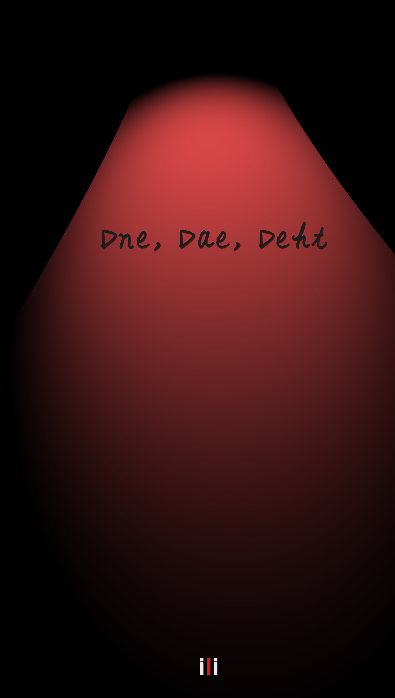

# dne-dae-deht

__Dne Dae Deht__ . The open source novel. Written in Korean.

## Introduction ##

A twenty years old boy who is longing to be a novelist lives every day with hunger. One day with all his money, he leaves his country and started to travel around the world. He is now at the end of the trip on Africa, and he meets a boy who is Afrikaners ...

## Cover ##
  

## How to run ##

Run the exe file on Windows

## License ##
This software is being made available under the terms in the [LICENSE](LICENSE) file.

## Useful Links ##
